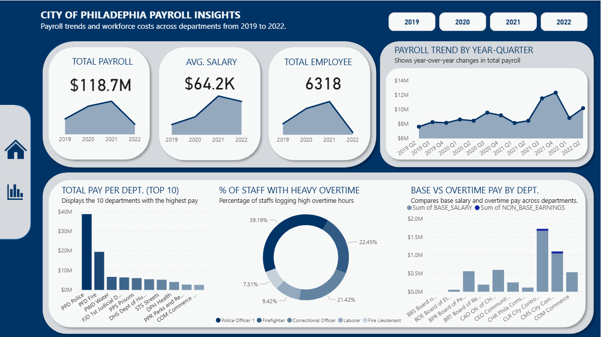
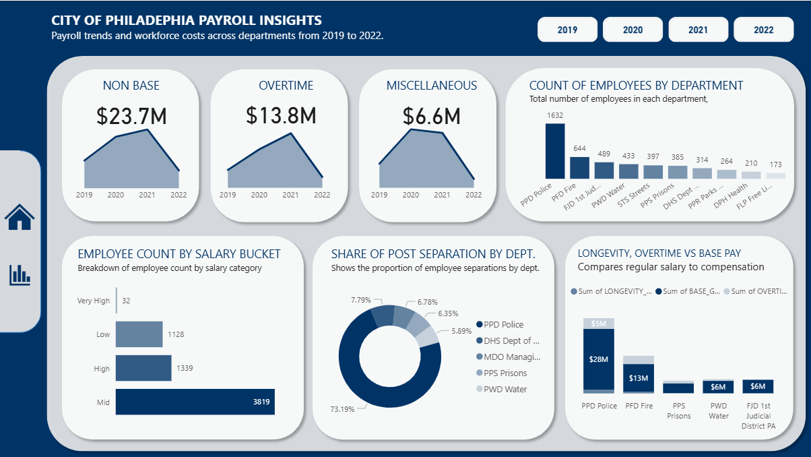

# Public Sector Payroll Transparency & Optimization  
###  City of Philadelphia Employee Earnings Analysis (Q2 2019–2022)

## Project Summary

This project analyzes the **City of Philadelphia's employee earnings** from **Q2 2019 to 2022**, using data extracted from the **OnePhilly payroll system**. The focus is to uncover key insights into payroll spending, workforce structure, compensation equity, and termination patterns across departments and job roles.

The goal is to support:

- Transparent payroll budgeting  
- Data informed resource planning  
- HR policy improvement  
- Workforce cost optimization  
- Fairness in public compensation

---

##  Dataset Overview

| Field Category     | Description |
|--------------------|-------------|
| **Earnings Data** | Base salary, overtime, bonuses, longevity pay, post-separation pay |
| **Employee Info** | Job title, job code, employee category, salaried vs. non-salaried |
| **Department Info** | Department name and code |
| **Time Dimension** | Year, quarter, separation month/year |

- **Dataset Name**: *Employee Earnings (Q2 2019  – 2022)*  
- **Publisher**: City of Philadelphia  
- **Source Link**: [https://www.phila.gov/data](https://www.phila.gov/data)  
- **Departments**:  
  - Office of Human Resources  
  - Office of the Director of Finance

---

##  Tools Used

| Tool         | Purpose |
|--------------|---------|
| **Microsoft Excel** | Data cleaning, formatting, and transformation |
| **Power BI**        | Interactive dashboards with KPIs, filters, and visualizations |

---

## Problem Statement

- Ensure fair and transparent compensation
- Identify departments/roles with unusual payroll spikes
- Track separation and post-separation payouts
- Optimize workforce costs while maintaining equity

---

## Key Metrics Tracked

| Metric | Description |
|--------|-------------|
| **Total Gross Pay** | Sum of all gross pay components |
| **Average Pay per Dept** | Total pay / employee count |
| **Overtime Dependence** | % of earnings from overtime |
| **Longevity Pay Ratio** | Longevity pay as % of total pay |
| **Separation Rate** | % of employees who left each quarter |
| **Post-Separation Cost** | Total payout after separation by department |

---

## Data Cleaning Summary

- **Formatted as Whole Number**: Quarter, Department Number, Public ID  
- **Formatted as Currency**: Base Salary, Overtime, Longevity Pay, etc.  
- **Renamed Columns**: `Title → Job Title`, `Employment Status → Employee Status`  
- **Handled Missing Values**:  
  - Replaced most nulls with `0` for transparency  
  - Kept nulls in `Base Gross Pay` to indicate non-salaried roles  

---

## Feature Engineering

| Feature | Description |
|---------|-------------|
| `TOTAL_GROSS_PAY_QTD` | Sum of all quarterly pay fields |
| `IS_ACTIVE` | Status of employee during quarter |
| `IS_SALARIED` | Binary indicator for salaried employees |
| `OVERTIME_RATIO` | Overtime as a share of total pay |
| `POST_SEPARATION_FLAG` | Indicates post-employment payouts |
| `TERMINATION_MONTH_YEAR` | Date field for separation |
| `LONGEVITY_RATIO` | Longevity as % of gross earnings |

---

## Key Insights

-  **Total Payroll (2019–2022): $118.7M**  
-  **Police & Fire Departments dominate payroll** due to size, rank, and tenure  
-  **High overtime** in security roles budget sensitivity required  
-  **Payroll dropped in 2022**, possibly due to cost control or fewer staff  
-  **Longevity pay** reveals many long serving employees  
-  **Post-separation payouts** are uneven across departments  
- ⚖ **Pay gaps** suggest internal income inequality

---

##  Recommendations

- **Audit high-earning departments** (especially Police and Fire) for performance-based spending
- **Balance workload** to reduce reliance on overtime
- **Track longevity costs** to prepare for workforce aging & retirement
- **Address pay disparities** using salary bucket analysis
- **Use dashboards** routinely for budgeting and HR strategy decisions
  
---

## 📄 License

This project uses publicly available data from the [City of Philadelphia Open Data Portal](https://www.phila.gov/data). No proprietary data is used.

---
## 📂 Project Files

### 📄 Documentation
- [README.md](./README.md) - Full project overview and insights  
- [Philadelphia_Payroll_Analysis_Presentation.pdf](./Philadelphia_Payroll_Analysis_Presentation.pdf) - Final report presentation

### 📊 Dataset
- [Employee_Earnings_Raw_Cleaned_Transformed_Dataset.xlsx](./Employee_Earnings_Raw_Cleaned_Transformed_Dataset.xlsx)

### 📈 Visualization

**Dashboard 1** 

**Dashboard 2**

